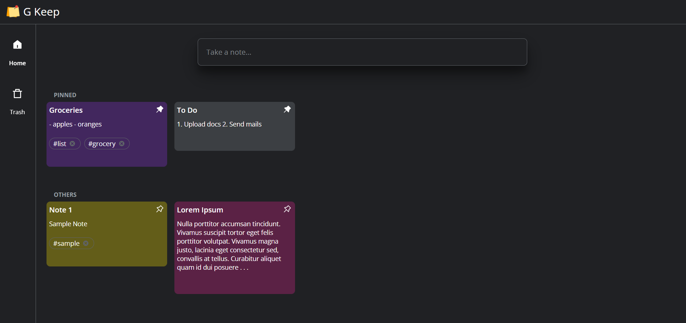
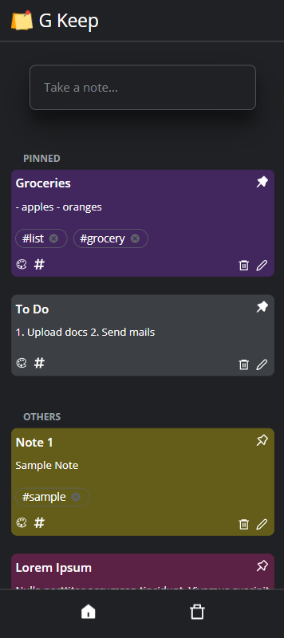
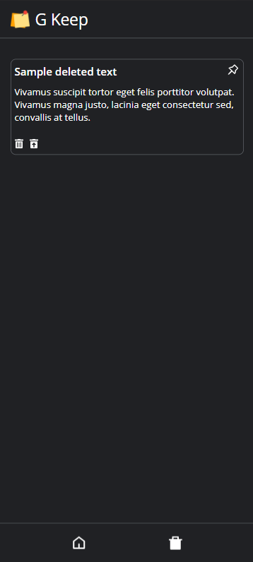

# G Keep

Notes taking app. UI/UX made to look like Google Keep.

Live link: https://gkeep-notes.netlify.app

---

## Tech stack

The app is written in React and uses react-router. The notes data is stored in LocalStorage.

## Features

- Add/Remove Notes
- Add tags to notes
- Color Code Notes
- Pin Notes

---

## Screenshots

### Desktop

### Mobile

<table align="center">
  <tr>
    <td></td>
    <td></td>
  </tr>
 </table>
